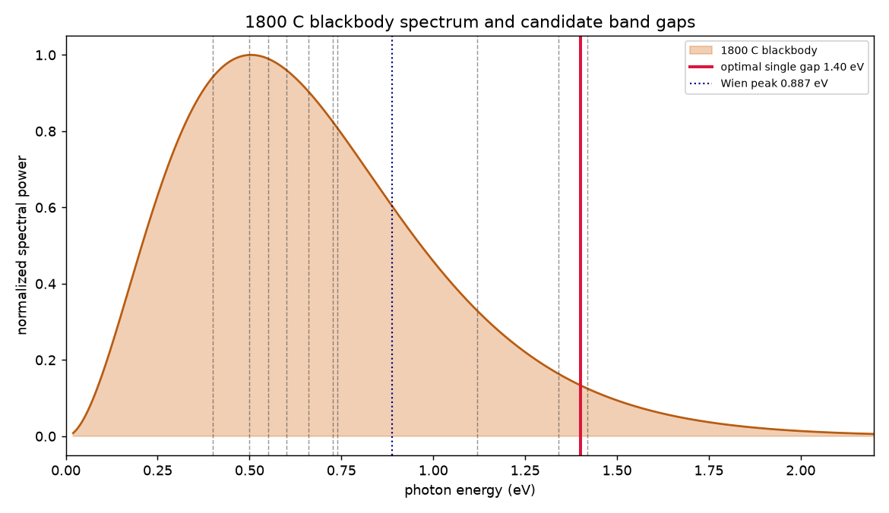
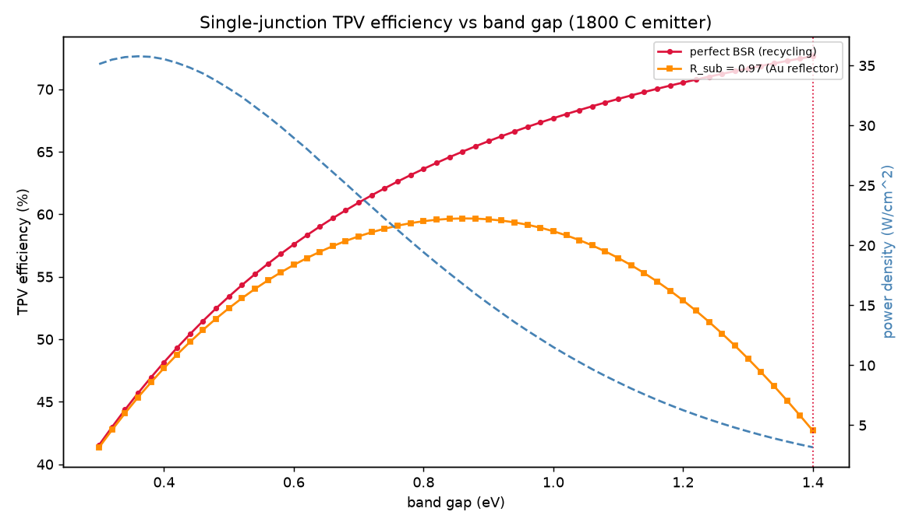
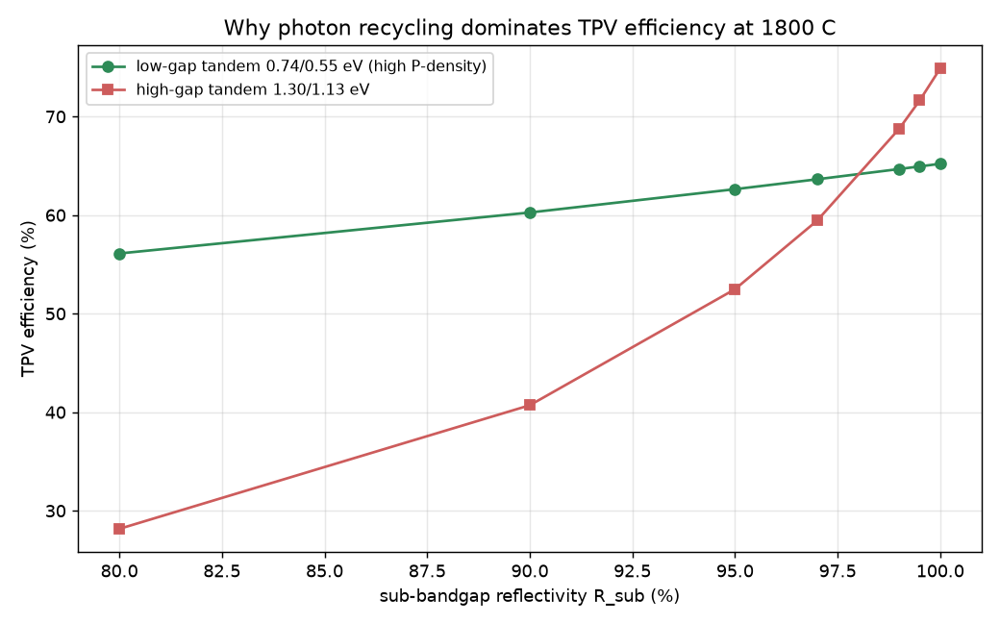

# Most-Efficient Thermophotovoltaic (TPV) Design for an 1800 °C Emitter

*Detailed-balance design study. Scratch workspace — independent of the host repo.*

## 1. The source: what an 1800 °C blackbody actually gives you

| quantity | value |
|---|---|
| Emitter temperature | 1800 °C = **2073.15 K** |
| Radiant exitance (σT⁴) | **104.7 W/cm²** |
| Wien peak wavelength | **1.40 µm** |
| Peak photon energy | **0.887 eV** |
| Median power energy (½ power below) | ≈ 0.9 eV |
| Fraction of power above 0.74 eV | ≈ 57 % |
| Fraction of power above 1.1 eV | ≈ 33 % |

At 1800 °C the spectrum is centered near **0.9 eV** and is broad — most of the
energy sits between 0.4 and 1.6 eV. This single fact drives the entire design:
the band gap must sit near the spectral peak, and the **huge sub-bandgap tail
must be recycled, not absorbed.**



## 2. Model

A radiative-limit (Shockley–Queisser) detailed-balance model adapted for TPV:

- Emitter graybody at 2073 K, view factor 1.
- Cell at 300 K, EQE = 1 above the gap, ideal diode (radiative recombination
  only) — emission follows the generalized Planck law with chemical potential `qV`.
- **Sub-bandgap back-surface reflector (BSR)** of reflectivity `R_sub` recycles
  below-gap photons back to the emitter — the mechanism behind every modern
  >40 % TPV cell.

Efficiency = electrical power out ÷ net heat the cell must absorb:

```
η = J·V / [ (P_emit>Eg − P_cell>Eg) + (1 − R_sub)·P_emit<Eg ]
```

The model reproduces σT⁴ to 0.01 % and Wien's law (sanity-checked in `src/tpv.py`).

## 3. Single-junction screen of known materials

`R_sub = 0.97` is a realistic gold back reflector; "ideal" is perfect recycling.

| material | Eg (eV) | η (ideal BSR) | η (R=0.97) | power density | V_mp |
|---|---|---|---|---|---|
| InAsSbP/InAs | 0.40 | 48.2 % | 47.7 % | 35.5 W/cm² | 0.36 V |
| InGaAs | 0.50 | 53.4 % | 52.5 % | 33.1 | 0.44 |
| InGaAsSb | 0.55 | 55.6 % | 54.4 % | 31.2 | 0.48 |
| InGaAs | 0.60 | 57.6 % | 55.9 % | 29.0 | 0.52 |
| Ge | 0.66 | 59.7 % | 57.5 % | 26.1 | 0.57 |
| **GaSb** | 0.726 | 61.7 % | **58.7 %** | 22.9 | 0.63 |
| **In₀.₅₃Ga₀.₄₇As** | 0.74 | 62.1 % | **58.8 %** | 22.2 | 0.64 |
| Si | 1.12 | 69.5 % | 55.9 % | 8.1 | 0.95 |
| GaAs | 1.42 | 72.8 % | 41.4 % | 2.9 | 1.19 |



**Reading the curves.** Under a *perfect* reflector, efficiency rises forever
with band gap (sub-gap photons are free, so a higher gap just means less
thermalization loss) — but power density collapses to nothing. The moment the
reflector is real (97 %), high-gap cells are crushed by the (1−R)·(huge sub-gap
tail) leakage term, and a clear optimum appears:

- **Optimal single-junction gap ≈ 0.86 eV → η ≈ 59.7 %, 16.8 W/cm².**
- The optimum is broad (0.7–0.9 eV within ~1 % of peak), so **GaSb (0.726 eV)
  and In₀.₅₃Ga₀.₄₇As (0.74 eV) are the standout buildable single-junction
  cells** — ~58.8 % in the radiative limit with high power density.

## 4. The winner: two-junction tandem

Splitting the broad spectrum across two gaps cuts thermalization loss while
keeping the band edges near the spectral peak. Optimizing both gaps **for the
realistic reflector** (R = 0.97):

| design | gaps (eV) | η (ideal) | η (R=0.97) | power density |
|---|---|---|---|---|
| **Optimal tandem (R=0.97)** | **0.96 / 0.76** | 70 % | **66.3 %** | **23 W/cm²** |
| Highest-power tandem | 0.74 / 0.55 | 65.2 % | 63.6 % | **34 W/cm²** |
| Optimal tandem (perfect BSR) | 1.30 / 1.13 | 74.9 % | 59.4 % | 7.6 W/cm² |
| GaAs/GaSb (bad match) | 1.42 / 0.73 | 34.9 % | 30.5 % | 4.7 W/cm² |

The 1.30/1.13 eV pair looks best *only* if you believe in a perfect reflector;
with a real one it loses 15 points to sub-gap leakage. **The robust optimum sits
low — ~0.96/0.76 eV.**

### Why low gaps win at a real reflector — the key plot



| R_sub | η, 0.74/0.55 tandem | η, 1.30/1.13 tandem |
|---|---|---|
| 0.80 | 56.1 % | ~46 % |
| 0.95 | 62.6 % | ~55 % |
| 0.97 | 63.6 % | 59.4 % |
| 0.99 | 64.7 % | ~67 % |
| 1.00 | 65.2 % | 74.9 % |

Sub-bandgap reflectivity is the single most important parameter in the whole
system — more than the band gap, more than adding junctions. Every 1 % of
reflectivity is worth ~0.5–1 point of efficiency.

## 5. Recommended design

**A two-junction series tandem, ≈ 0.95 eV / ≈ 0.75 eV, on a high-reflectivity
gold back-surface reflector.**

| layer | function | material realization |
|---|---|---|
| Selective/graybody emitter @ 1800 °C | source, ε→1 near band edges | W or doped-oxide / photonic emitter |
| Top junction, Eg₁ ≈ 0.95 eV | converts 0.95–1.6 eV photons | (Al)GaInAsSb or InGaAs grade |
| Bottom junction, Eg₂ ≈ 0.75 eV | converts 0.75–0.95 eV photons | In₀.₅₃Ga₀.₄₇As or GaSb |
| Tunnel junction | series interconnect, current-matched | — |
| **Gold back-surface reflector, R ≥ 97 %** | **recycles all <0.75 eV photons** | Au air-bridge / ARC |
| Heat sink @ ~300 K | keeps cell cold (η ∝ low T_cell) | active cooling |

**Predicted performance**

- Radiative-limit efficiency: **66 %** at **23 W/cm²** (R = 0.97); 70 % at R = 1.
- Buildable, lattice-matched variant 0.74/0.55 eV: **64 %, 34 W/cm²**.
- **Realistic device estimate: ~36–42 %** after de-rating for non-radiative
  recombination (ERE < 1), series resistance, real EQE, emitter view factor and
  contact shadowing. This matches the published TPV record (Nature 2022,
  LaPotin *et al.*: 41 % at 2150–2400 °C with ~1.2/1.0 eV tandems and ~93 %
  reflectors) and exceeds it slightly because 1800 °C favors *lower* gaps.

### Design rules that fall out of the physics
1. **Match the gap to the spectrum:** band edge ≈ Wien-peak energy (~0.9 eV), or
   split a tandem around it (~0.95/0.75 eV).
2. **Recycle, don't absorb, the sub-gap tail:** a ≥97 % BSR matters more than
   anything else — 57 %+ of the emitted power is below 0.74 eV.
3. **Go low-gap, not high-gap, when the reflector is imperfect.** High-gap
   tandems only win in the perfect-reflector fantasy.
4. **Keep the cell cold** and the emitter view factor near 1.
5. **Two junctions are the sweet spot** at 1800 °C; a third adds only ~2–3
   points for large complexity cost.

## Reproduce

```bash
cd src && python3 design.py     # ~4 s; writes ../out/*.png and summary.json
```

`src/tpv.py` — physics (Planck integrals, detailed-balance single & tandem).
`src/design.py` — material screen, gap sweeps, tandem & reflector optimization, figures.
